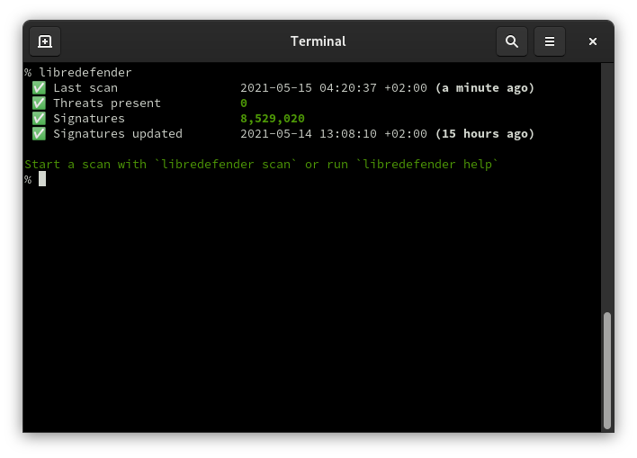

# libredefender

Imagine the information security compliance guideline says you need an antivirus but you run Arch Linux.

<p align="center"></p>

libredefender is an antivirus program featuring:

- **Industry standards** - Scanning is implemented with libclamav
- **Signatures** - We have that
- **Scheduling** - Starts scans periodically so you don't have to
- **Checkmarks** - Extra green

The process is trying to change both io and processor priority to idle.

`clamav-freshclam.service` needs to be setup.

## Example config

The configuration file is loaded from **~/.config/libredefender.toml**:

```toml
[scan]
excludes = [
    # rust build folders
    "/home/user/repos/**/target",
]
## by default libredefender spawns one thread per cpu core
## set to 1 to use a single thread
#concurrency = 1
skip_hidden = true
skip_larger_than = "30MiB"

[update]
## use data fetched by clamav-freshclam.service (default)
path = "/var/lib/clamav"

[schedule]
preferred_hours = "09:00:00-19:00:00"
## Do not run scans when on battery
skip_on_battery = true
```

## Installation

<a href="https://repology.org/project/libredefender/versions"></a>

    pacman -S libredefender

## Icons

Icons made by [Smashicons](https://www.flaticon.com/authors/smashicons) from [www.flaticon.com](https://www.flaticon.com/).

## License

This code is dual-licensed as `GPLv2 OR GPLv3+`. libclamav is currently likely to be considered GPLv2-only, so the final binary is going to be GPLv2. If the need for GPLv2 is resolved we're likely going to drop GPLv2 compatibility.

Note that both licenses have a "No warranty" clause.
